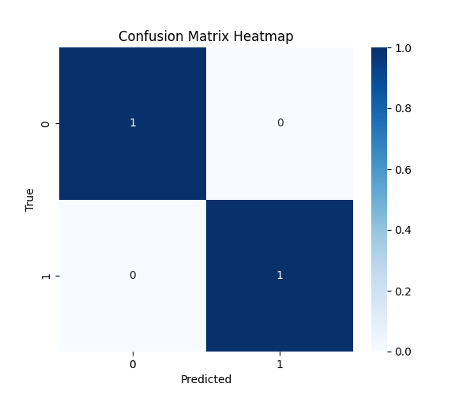

🎬 SceneSense — AI Movie Scene Finder & Mood Classifier
📌 Overview

SceneSense is an AI-driven multimodal pipeline that automatically analyzes movies or TV episodes to:

Detect scene boundaries

Classify scene moods/emotions (Happy, Sad, Tense, Romantic, Action)

Generate metadata, insights, and visualizations for search and recommendations

It fuses video, audio, and subtitle text features to deliver scene-level analysis.

⚙️ Features

✅ Video processing (color histograms, frame-level features)
✅ Audio feature extraction (MFCCs, energy, tempo)
✅ Subtitle-based sentiment analysis (VADER)
✅ Multimodal fusion into a unified feature vector
✅ Scene-level mood classification
✅ Export outputs:

SceneSense/
│
├── processed_video.h5     # Saved features & labels
├── scene_model.pkl        # Scene boundary detector (dummy baseline)
├── mood_model.pkl         # Mood classifier model
├── insights.json          # Accuracy, confusion matrix, stats
├── build_metadata.yaml    # Metadata of pipeline run
├── predictions.csv        # Final predictions per video
└── visuals/               # Graphs and heatmaps
    ├── accuracy.png
    ├── confusion_matrix.png

🛠️ Tech Stack

Video: OpenCV

Audio: Librosa

Text: VADER Sentiment, HuggingFace (optional extension)

ML: Scikit-learn (Logistic Regression baseline, extendable to deep models)

Visualization: Matplotlib, Seaborn

📂 Dataset / Inputs

The pipeline expects video + subtitle pairs in your archive/ folder. Example:

C:\Users\NXTWAVE\Downloads\AI Movie Scene Finder\archive\
│── 1.mp4
│── 1.txt
│── 2.mp4
│── 2.txt
│── 3.mp4
│── 3.txt
│── 4.mp4
│── 4.txt
│── 5.mp4
│── 5.txt

Each .mp4 file should have a corresponding .txt subtitle/transcript.

🚀 How to Run
1. Install Requirements
pip install opencv-python librosa numpy pandas matplotlib seaborn scikit-learn vaderSentiment h5py pyyaml

2. Train + Evaluate

Run the training + evaluation script:

python scene_sense_eval_plot.py

This will:

Extract features

Train models

Print classification report

Plot accuracy graph & confusion matrix heatmap on screen

3. Make Predictions on All Videos
python scene_sense_predict.py

This generates:

predictions.csv

Example:

video,subtitle,predicted_label,confidence
1.mp4,1.txt,Happy,0.82
2.mp4,2.txt,Sad,0.74
3.mp4,3.txt,Tense,0.68

4. Predict a Single Video’s Emotion
python scene_sense_single_predict.py

Output:

🎬 Video: 1.mp4
📄 Subtitles: 1.txt
💡 Predicted Emotion: Tense (Confidence 0.78)

📊 Outputs & Visuals

Accuracy Graph → shows model accuracy as a bar chart

Confusion Matrix Heatmap → evaluates prediction errors

Predictions.csv → final results with confidence scores

🔮 Future Enhancements

Replace dummy Logistic Regression with deep multimodal transformer

Use PySceneDetect for advanced scene boundary detection

Integrate HuggingFace emotion models for richer text analysis

Deploy as an interactive web app (Flask/FastAPI + React/Streamlit)

Add “jump-to-scene” player controls for smart video navigation

📈 Business Use Cases

Smart video players → “jump to happy/tense scene”

Content recommendation engines (Netflix-style)

Film analysis & editing tools

Viewer engagement insights (emotional highs/lows)

👨‍💻 Author

Project scaffolding & pipeline setup by Sagnik Patra
GitHub: sagnik1-patra

LinkedIn: linkedin.com/in/sagnik2212
